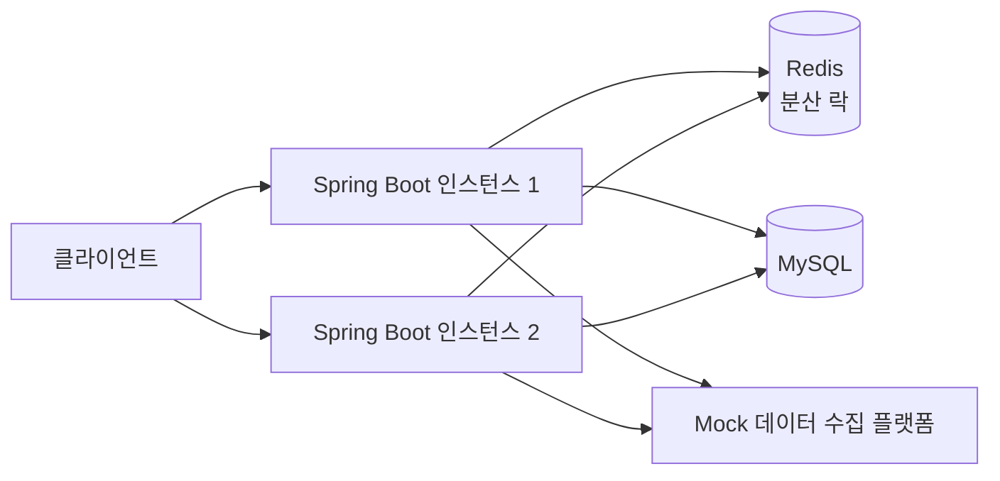
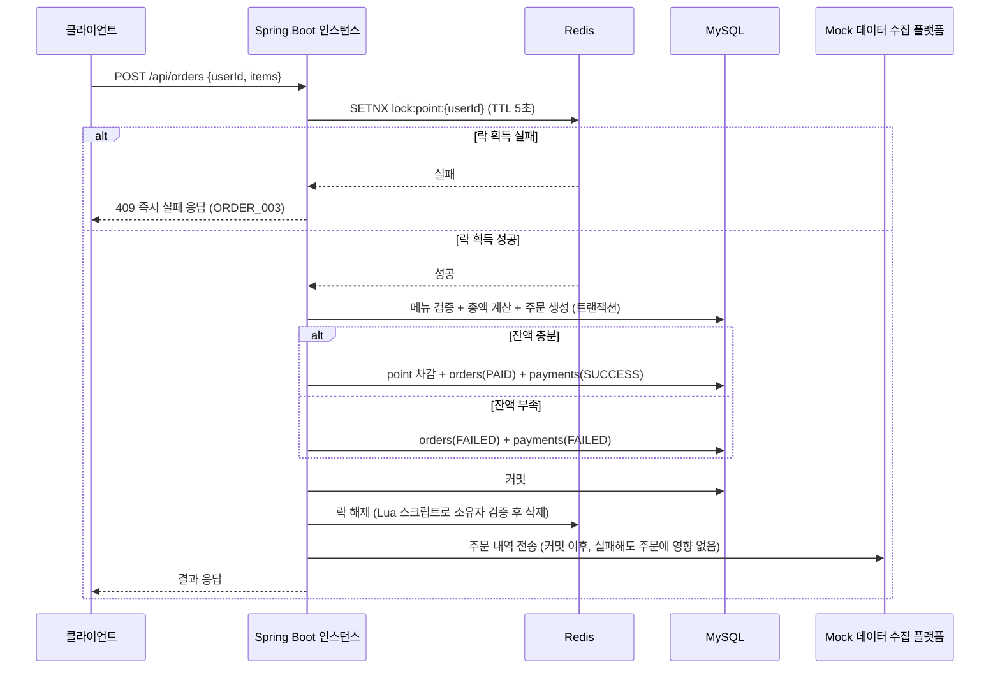
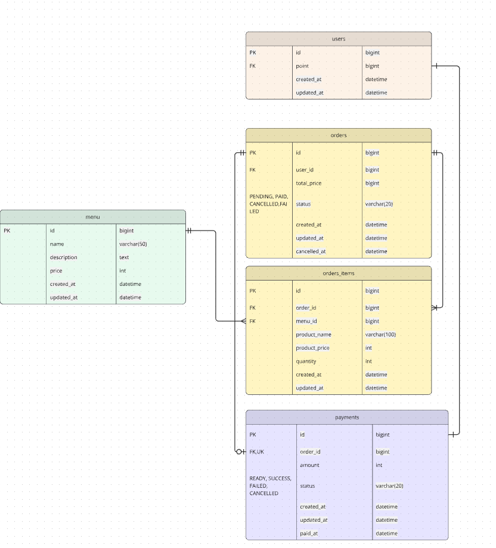

# ☕ coffeeshop-order-systems

## 프로젝트 소개

다수 서버 인스턴스 환경에서도 안정적으로 동작하는 커피숍 주문 시스템입니다.

메뉴 조회, 포인트 충전, 포인트 기반 주문/결제, 최근 7일 인기 메뉴 조회 기능을 제공합니다. 별도의 회원가입·로그인 없이 사용자 식별값을 직접 입력받는 구조이며, 서버가 여러 대로 떠 있을 때도 포인트 잔액이 꼬이지 않도록 Redis 분산 락으로 동시성을 제어합니다.

---


---

## 🚀 시작하기 (Getting Started)

### 요구 사항

| 항목 | 버전 |
|---|---|
| JDK | 17 |
| Gradle | Wrapper 포함 (`./gradlew`) |
| MySQL | 8.4 (Docker Compose로 제공) |
| Redis | 7.4 (Docker Compose로 제공) |

### 1. 인프라(MySQL, Redis) 실행

```bash
docker compose up -d
```

### 2. 애플리케이션 실행

```bash
./gradlew bootRun
```

앱이 뜨면 `data.sql`로 메뉴 6종, 테스트 유저 2명(`userId=1` 잔액 20000원, `userId=2` 잔액 1000원)이 자동으로 들어갑니다.

### 3. 테스트 (동시성 테스트 포함)

```bash
./gradlew test
```

`OrderConcurrencyTest`는 한 사용자에게 동시에 5개의 주문 요청을 보내, 잔액이 초과 차감되지 않고 정확히 계산되는지 검증합니다.

### 4. 다수 인스턴스 동작 확인

```bash
docker compose up -d --scale app=2
```

동일 사용자로 서로 다른 인스턴스에 동시에 주문/결제 요청을 보내도, Redis 분산 락이 인스턴스 간 공유 자원(포인트 잔액)을 보호해 잔액이 꼬이지 않습니다.

---

## 🛠 개발 환경

| 구분 | 사용 기술 |
|---|---|
| Backend | Java 17, Spring Boot 4.1.1 |
| Database | MySQL 8.4, Spring Data JPA |
| Cache / Lock | Redis 7.4 (분산 락) |
| 외부 연동 | Spring RestClient (데이터 수집 플랫폼 Mock 전송 — httpbin.org) |
| 테스트 | JUnit 5, AssertJ, ExecutorService 기반 동시성 테스트 |
| 로컬 컨테이너 | Docker Compose |

---

## 🏗 아키텍처

### 다수 인스턴스 구조



인스턴스는 메모리·영속성 컨텍스트를 공유하지 않으므로, 포인트 잔액처럼 여러 인스턴스에서 동시에 접근 가능한 자원은 Redis를 공용 락으로 사용해 보호합니다.

### 주문/결제 흐름



---

## 📌 주요 도메인 구조

### 패키지 구조

```
com.coffeeshopordersystems
├── domain
│   ├── user      # 사용자 식별값 처리(find-or-create), 포인트 잔액 관리
│   ├── menu      # 메뉴 목록 / 인기 메뉴 조회
│   ├── order     # 주문 생성, 상태 관리, 락 조율(OrderService) + 트랜잭션 로직(OrderCoreService)
│   └── payment   # 결제 결과 기록
├── infra
│   ├── lock      # Redis 분산 락 (RedisLockService)
│   └── client    # RestClient로 데이터 수집 플랫폼 전송 (OrderEventClient)
└── global
    ├── config    # Redis 설정
    ├── exception # 공통 예외처리 (BusinessException, ErrorCode, GlobalExceptionHandler)
    └── dto       # 공통 응답 포맷 (ApiResponse)
```

`OrderService`(락 획득/해제 담당)와 `OrderCoreService`(`@Transactional` 비즈니스 로직)를 분리한 이유: 같은 클래스 안에서 셀프 호출(self-invocation)로 `@Transactional` 메서드를 호출하면 Spring AOP 프록시를 거치지 않아 트랜잭션이 적용되지 않습니다. 이를 피하기 위해 락 담당 클래스와 트랜잭션 담당 클래스를 분리했습니다.

---

## 📄 ERD



| 테이블 | 주요 컬럼 |
|---|---|
| `users` | id(PK, 클라이언트 지정값), point, created_at, updated_at |
| `menus` | id, name, description, price, created_at, updated_at |
| `orders` | id, user_id(FK), total_price, order_status(PENDING/PAID/FAILED/CANCELLED), cancelled_at |
| `order_items` | id, order_id(FK), menu_id(FK), product_name, product_price, quantity |
| `payments` | id, order_id(FK, UK), amount, payment_status(READY/SUCCESS/FAILED/CANCELLED), paid_at |

---

## 📄 API 명세

### 1. 메뉴 목록 조회
`GET /api/menus`

```json
{
  "code": "SUCCESS",
  "message": "메뉴 목록 조회에 성공했습니다.",
  "data": { "menus": [ { "menuId": 1, "name": "아이스 아메리카노", "description": "...", "price": 4500 } ] }
}
```

### 2. 포인트 충전
`POST /api/points/charge`

요청: `{ "userId": 1, "amount": 10000 }`

```json
{
  "code": "SUCCESS",
  "message": "포인트 충전에 성공했습니다.",
  "data": { "userId": 1, "point": 30000 }
}
```
에러: `400 POINT_001` 충전 금액이 0 이하

### 3. 주문 및 결제
`POST /api/orders`

요청: `{ "userId": 1, "items": [ { "menuId": 1, "quantity": 2 } ] }`

```json
{
  "code": "SUCCESS",
  "message": "주문 및 결제에 성공했습니다.",
  "data": {
    "orderId": 1, "status": "PAID", "totalPrice": 9000, "remainingPoint": 26000,
    "items": [ { "menuId": 1, "name": "아이스 아메리카노", "quantity": 2, "price": 4500 } ]
  }
}
```
에러: `400 ORDER_001` 포인트 부족 / `404 ORDER_002` 존재하지 않는 메뉴 / `409 ORDER_003` 동시 요청으로 처리 중(즉시 실패)

### 4. 인기 메뉴 조회
`GET /api/menus/popular`

```json
{
  "code": "SUCCESS",
  "message": "인기 메뉴 목록 조회에 성공했습니다.",
  "data": { "menus": [ { "menuId": 1, "name": "아이스 아메리카노", "orderCount": 42 } ] }
}
```
최근 7일(`NOW() - INTERVAL 7 DAY` 슬라이딩 윈도우) 기준 주문 횟수 상위 3개. 동점일 경우 `menuId` 오름차순으로 결정적 정렬을 보장합니다.

---

## 🧩 설계 의도 및 기술 선택 이유

**인증/인가를 구현하지 않은 이유**
요구사항이 사용자 식별값을 직접 입력받는 구조를 전제하고 있어, 로그인/세션/토큰 계층을 두지 않았습니다. 대신 존재하지 않는 `userId`로 포인트 충전/주문 요청이 오면 잔액 0으로 신규 생성(find-or-create)하여, 사실상 "최초 충전"이 가입을 겸하도록 했습니다.

**`orders`와 `payments`를 분리한 이유**
주문(사용자 의도)과 결제(금전 처리 결과)의 상태를 독립적으로 관리하기 위함입니다. 결제가 실패해도 주문 자체는 `FAILED` 상태로 이력이 남아, 실패 원인 추적이 가능합니다.

**포인트 이력 테이블을 두지 않은 이유**
요구사항에 포인트 이력 조회 API가 없어, `users.point` 잔액 컬럼 하나로만 관리했습니다. 이력 테이블 추가는 이번 과제 범위를 벗어나는 과한 설계라 판단했습니다.

**Redis 분산 락을 선택한 이유**
서버 한 대에서는 비관적 락(DB row lock)이나 낙관적 락(`@Version`)으로 충분합니다. 하지만 서버가 여러 인스턴스로 뜨는 환경에서는 각 인스턴스가 서로의 상태를 모르고 영속성 컨텍스트도 독립적입니다. DB 비관적 락은 "DB 접근 순간"만 보호하지만, 포인트 차감은 "잔액 조회 → 검증 → 차감 → 기록"까지 이어지는 비즈니스 로직 전체를 보호해야 합니다. 인스턴스 외부(Redis)에 공용 락을 두면, 이 로직 전체를 인스턴스 수와 무관하게 "한 번에 하나씩" 처리할 수 있습니다.

락 키는 `lock:point:{userId}`로 설정해 포인트 충전과 주문/결제가 같은 사용자의 잔액을 동시에 건드리는 경우까지 함께 보호합니다. 락 획득은 Redis `SETNX`(`setIfAbsent`)로 원자적으로 수행하고 TTL을 둬 서버 장애 시 락이 영구적으로 풀리지 않는 상황을 방지했습니다. 락 해제는 Lua 스크립트로 "내가 건 락인지"(값 비교) 확인 후 삭제해, 다른 요청이 보유한 락을 실수로 해제하는 문제를 막았습니다.

**락 획득 실패 시 "즉시 실패" 전략을 선택한 이유**
주문/결제/충전은 동일 요청이 중복 실행되면 안 되는 작업입니다. 재시도 전략은 사용자가 응답을 늦게 받는 대가로 성공 확률을 높이지만, 결제처럼 민감한 로직에서는 재시도 중 추가 동시성 이슈가 발생할 여지가 있어 단순하고 예측 가능한 즉시 실패를 선택했습니다.

**데이터 일관성 — 외부 전송을 트랜잭션 밖에서 수행**
포인트 차감, 주문 생성, 결제 기록은 하나의 트랜잭션으로 묶입니다. 반면 데이터 수집 플랫폼으로의 전송(RestClient 호출)은 트랜잭션 커밋 이후에 수행해, 외부 API 실패가 결제 자체를 롤백시키지 않도록 분리했습니다.

**인기 메뉴 — 캐시 없이 실시간 집계한 이유**
"메뉴별 주문 횟수가 정확해야 한다"는 요구사항과 캐싱은 상충합니다. 캐시 갱신 주기 사이에 들어온 주문은 랭킹에 반영되지 않아 정확성이 깨지기 때문입니다. 이 과제 규모에서는 트래픽/성능에 대한 요구사항이 없어, 별도 기술(Redis 캐싱, 랭킹 자료구조) 도입보다 `GROUP BY` + `COUNT` SQL로 실시간 집계하는 쪽이 요구사항에 더 부합한다고 판단했습니다. 성능이 실제로 문제가 된다면 캐싱보다 가벼운 `order_items(created_at, menu_id)` 복합 인덱스로 대응할 수 있습니다.

**RestClient(동기)를 선택한 이유**
결제 확정 로직은 순서가 중요하고, 이 과제 규모에서 동시 요청이 수천 TPS에 달하지 않아 비동기(WebClient) 도입의 실익이 없다고 판단했습니다.

---

## 🧪 동시성 테스트 결과

`OrderConcurrencyTest`: 잔액 13,500원(메뉴 가격 4,500원 × 3) 사용자에게 동시에 5개의 주문 요청을 보낸 결과, 즉시 실패 전략에 따라 1개만 성공하고 4개는 락 획득 실패로 즉시 거부되었습니다. 성공한 1건만큼 정확히 9,000원이 차감되어(13,500 → 9,000) 잔액이 음수로 가거나 중복 차감되는 현상 없이 일관성이 유지되는 것을 확인했습니다.

---

## 🧪 트러블슈팅

- **`@Transactional` 셀프 호출 문제**: 락 획득/해제 로직과 트랜잭션 로직을 같은 클래스 안에서 `this.method()`로 호출했더니 Spring AOP 프록시를 거치지 않아 트랜잭션이 적용되지 않고 포인트 차감이 저장되지 않는 문제가 있었습니다. `OrderService`(락)와 `OrderCoreService`(트랜잭션)를 별도 Bean으로 분리해 해결했습니다.
- **Redis Lua 스크립트 문법 오류**: 락 해제용 Lua 스크립트를 문자열로 이어붙이는 과정에서 공백이 빠져 `thenreturn`처럼 토큰이 붙어버려 스크립트 컴파일 에러가 발생했습니다.
- **JPA Auditing 미설정**: `@CreatedDate`/`@LastModifiedDate`가 동작하려면 `@EnableJpaAuditing`을 명시적으로 켜야 하는데 누락되어, 코드로 새로 생성하는 엔티티(`Order` 등)의 `created_at`이 `NULL`로 들어가 INSERT가 실패했습니다.
